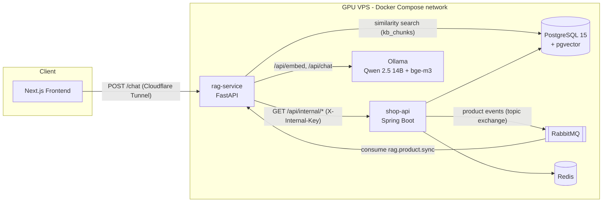
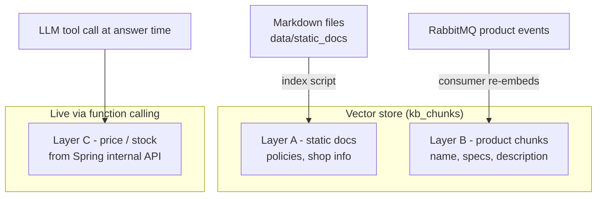
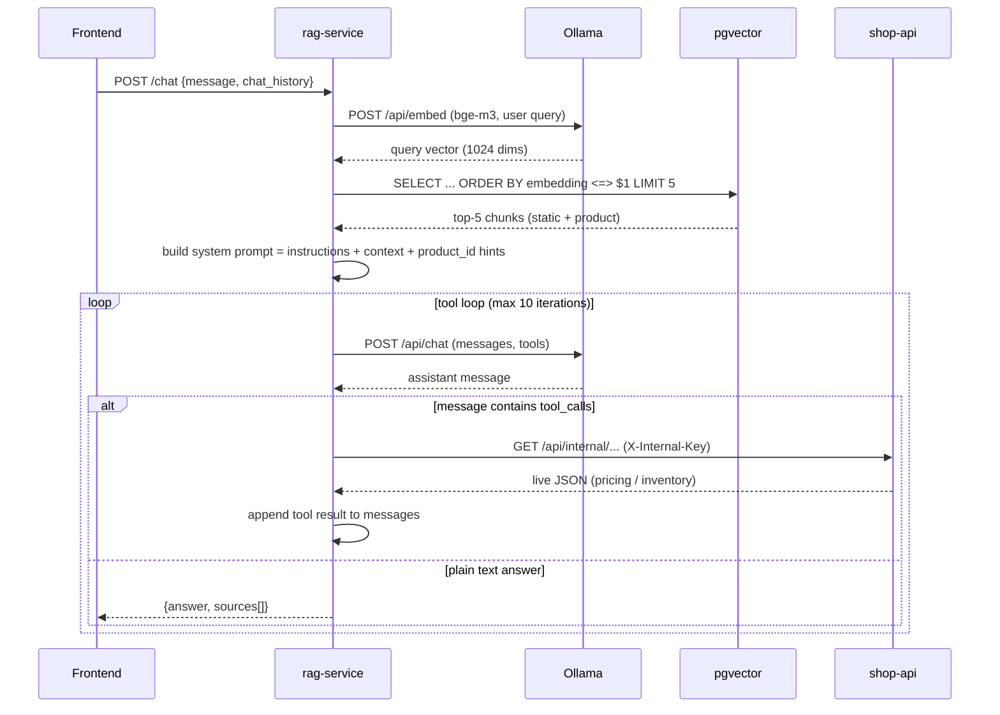
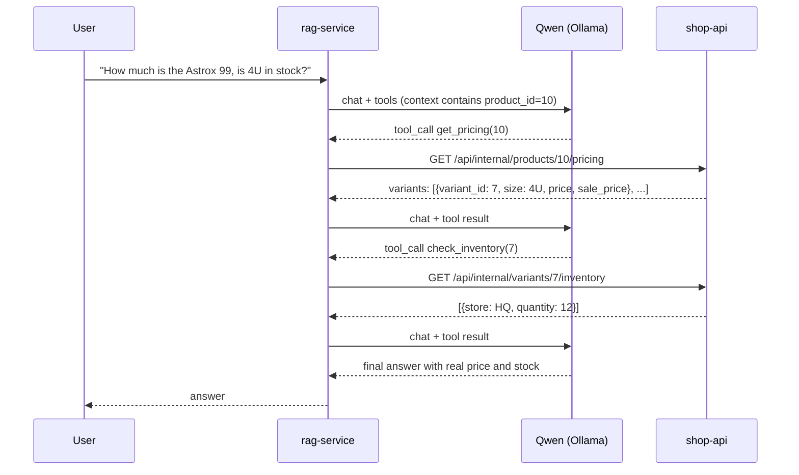
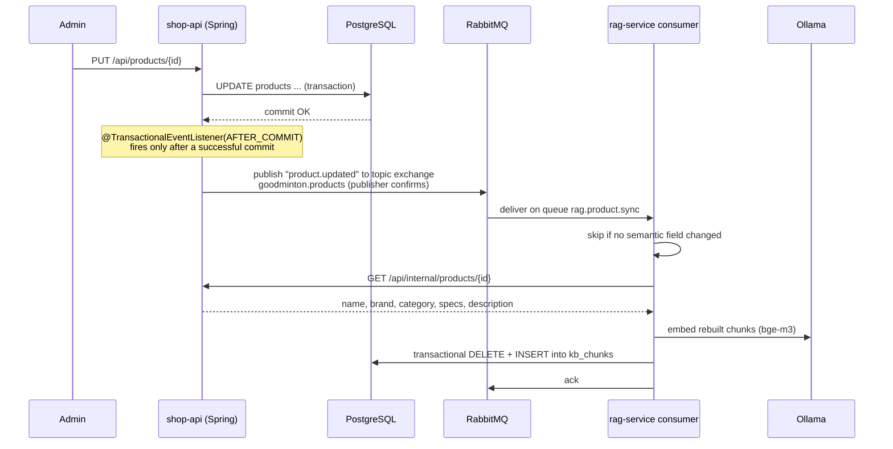
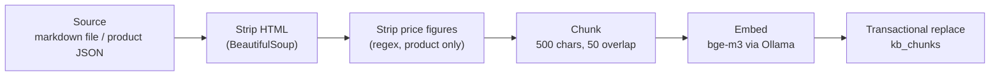
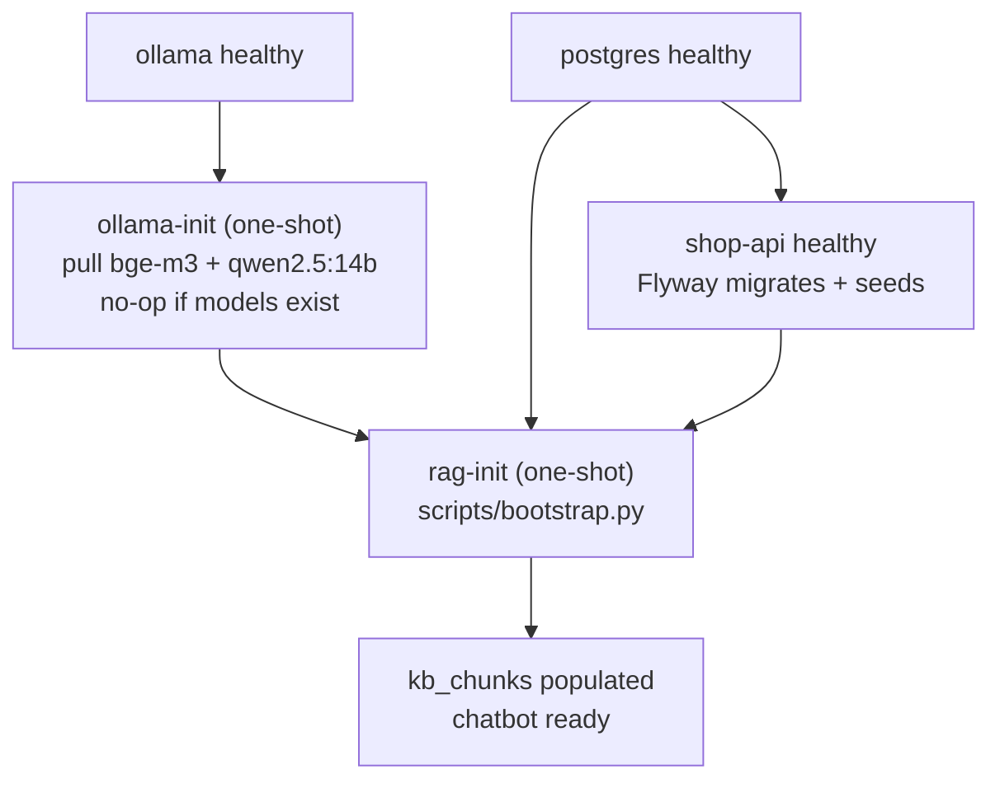
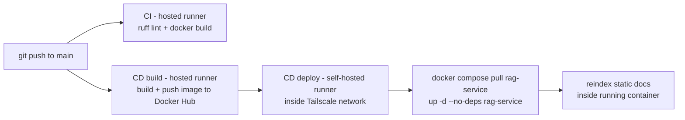

# Goodminton RAG Service

A Retrieval-Augmented Generation (RAG) service that powers the product-advisory chatbot of the Goodminton badminton e-commerce platform. It answers natural-language questions about products, shop policies, and real-time price/stock — grounded in actual shop data, never fabricated.

**Tech stack:** Python 3.11, FastAPI, PostgreSQL + pgvector, Ollama (Qwen 2.5 14B Instruct + bge-m3), RabbitMQ (aio-pika), httpx, uv, Docker, GitHub Actions.

| Concern | Technology | Notes |
|---|---|---|
| HTTP API | FastAPI + Uvicorn | Async, single `POST /chat` endpoint |
| LLM | Qwen 2.5 14B Instruct (Q4_K_M) | Self-hosted via Ollama, GPU-accelerated |
| Embeddings | bge-m3 (1024 dims) | Multilingual, strong Vietnamese support |
| Vector store | pgvector on PostgreSQL 15 | HNSW index, cosine distance |
| Event consumption | RabbitMQ via aio-pika | Topic exchange, durable queue, DLQ |
| Live data | Spring Boot internal REST API | LLM function calling, shared-key auth |
| Dependency management | uv (`pyproject.toml` + `uv.lock`) | |
| Delivery | Docker + GitHub Actions | Self-hosted runner deploys via Docker Compose |

---

## Table of Contents

1. [System Architecture](#1-system-architecture)
2. [Three-Layer Knowledge Model](#2-three-layer-knowledge-model)
3. [Chat Request Flow](#3-chat-request-flow)
4. [Tool Calling: Real-Time Price and Stock](#4-tool-calling-real-time-price-and-stock)
5. [Product Sync: Spring to RAG via RabbitMQ](#5-product-sync-spring-to-rag-via-rabbitmq)
6. [Indexing Pipeline](#6-indexing-pipeline)
7. [Self-Healing Bootstrap](#7-self-healing-bootstrap)
8. [API Contract](#8-api-contract)
9. [Repository Layout](#9-repository-layout)
10. [Configuration](#10-configuration)
11. [Local Development](#11-local-development)
12. [Deployment and CI/CD](#12-deployment-and-cicd)

---

## 1. System Architecture

The RAG service is one of six containers in the Goodminton stack. It talks to PostgreSQL (vector search), Ollama (LLM + embeddings), RabbitMQ (product-change events in), and the Spring Boot shop API (live data out).



Key properties:

- **Fully self-hosted AI.** No external LLM API. Ollama runs Qwen 2.5 14B and bge-m3 on a local GPU; all knowledge lives in pgvector inside the same PostgreSQL instance the shop already uses.
- **Only the application port is exposed.** PostgreSQL, Redis, RabbitMQ, and Ollama are reachable exclusively inside the Docker network. Public traffic enters through a Cloudflare Tunnel.
- **Two communication styles with Spring:** asynchronous events (RabbitMQ) for knowledge sync, and synchronous REST (internal API) for live data during a chat turn.

## 2. Three-Layer Knowledge Model

The central design decision: data is split into three layers by how often it changes, and each layer has its own storage and update path.

| Layer | Content | Changes | Stored in | Updated by |
|---|---|---|---|---|
| A. Static knowledge | Shop policies (warranty, returns), shop info, stringing guide | Rarely | `kb_chunks` (`doc_type = 'static'`) | Markdown files in this repo; reindexed on deploy |
| B. Product knowledge | Name, brand, category, specifications, description | Occasionally | `kb_chunks` (`doc_type = 'product'`) | RabbitMQ events from Spring on every product change |
| C. Real-time data | Price, sale price, stock per store | Constantly | Spring's own tables only | Never indexed — fetched live via LLM function calling |



Why layer C is never embedded: prices and stock change with every sale or promotion. A vector store is a snapshot; embedding volatile numbers guarantees stale answers. Instead, the description text is stripped of any price figures before indexing, which forces the LLM to call the pricing tool whenever a user asks about money or availability.

## 3. Chat Request Flow

End-to-end path of one `POST /chat` request:



Steps in detail:

1. **Embed.** The user query is embedded with bge-m3 through Ollama's `/api/embed`.
2. **Retrieve.** Cosine similarity search over `kb_chunks` (HNSW index) returns the top-5 most relevant chunks, regardless of layer — a policy question surfaces static chunks, a product question surfaces product chunks.
3. **Assemble prompt.** The system prompt contains the advisory rules, the retrieved context, and a separate list of candidate `product_id`s (kept out of the prose so the model does not leak IDs into answers, but can pass them to tools).
4. **Generate with tools.** The LLM either answers directly or emits `tool_calls`. Tool results are appended and the model is called again, up to 10 iterations.
5. **Respond.** The final text plus deduplicated source references (`doc_type`, `source_id`) go back to the client.

## 4. Tool Calling: Real-Time Price and Stock

Two tools are registered with the LLM. The dispatcher maps tool calls to Spring's internal endpoints, which are protected by a shared `X-Internal-Key` header and are only reachable inside the Docker network.

| Tool | Spring endpoint | Returns |
|---|---|---|
| `get_pricing(product_id)` | `GET /api/internal/products/{id}/pricing` | All variants with color, size, SKU, price, sale price |
| `check_inventory(variant_id)` | `GET /api/internal/variants/{id}/inventory` | Quantity per store branch |



Design notes:

- The multi-step chain is driven by the model itself: pricing first (to discover `variant_id`s), then inventory. The service only executes and feeds back results.
- Tool failures return a JSON `{"error": ...}` payload to the model instead of raising, so the bot can apologize gracefully rather than crash the request.
- A hard iteration cap (10) prevents infinite tool loops when retrieval surfaces the wrong product.

## 5. Product Sync: Spring to RAG via RabbitMQ

When an administrator creates, updates, or deletes a product in the shop, the RAG knowledge base follows automatically. The two services never call each other synchronously for this — the sync is fully event-driven.



Reliability mechanics:

- **After-commit publishing.** The event leaves Spring only if the database transaction committed, so the vector store can never receive an event for a rolled-back change.
- **Publisher confirms + returns callback.** The broker acknowledges each publish; unroutable messages are logged instead of dropped silently.
- **Topic exchange, `product.*` binding.** `product.created`, `product.updated`, and `product.deleted` all route to the durable queue `rag.product.sync`. Future consumers (analytics, cache invalidation) can bind their own queues without touching the producer.
- **Semantic-field filter.** The event carries `fieldsChanged`; if only layer-C fields (price, stock) changed, the consumer acknowledges without re-embedding.
- **Idempotent replace.** Re-indexing a product is a transactional delete-and-insert keyed by `(doc_type, source_id)`; processing the same event twice converges to the same state, which makes RabbitMQ's at-least-once delivery safe.
- **Dead-letter queue.** Messages that keep failing are rejected without requeue and land in `rag.product.sync.dlq` for inspection, instead of blocking the queue.

## 6. Indexing Pipeline

Both static docs and product content go through the same pipeline before reaching pgvector:



- Product descriptions arrive as scraped HTML; tags are removed and the plain text is scrubbed of VND amounts (layer C must not leak into layer B).
- Chunks are split with a recursive character splitter (500 characters, 50 overlap) tuned for short Vietnamese product copy.
- The delete-and-insert for each source runs inside a single transaction: if any embed call fails halfway, the previous chunks survive.

Table schema (Flyway migration `V7` in the shop-api repo):

```sql
CREATE TABLE kb_chunks (
    id          BIGSERIAL PRIMARY KEY,
    doc_type    VARCHAR(20)  NOT NULL,   -- 'static' | 'product'
    source_id   VARCHAR(200) NOT NULL,   -- file name | product id
    chunk_index INTEGER      NOT NULL,
    content     TEXT         NOT NULL,
    metadata    JSONB        DEFAULT '{}',
    embedding   VECTOR(1024),
    UNIQUE (doc_type, source_id, chunk_index)
);
CREATE INDEX ON kb_chunks USING hnsw (embedding vector_cosine_ops);
```

## 7. Self-Healing Bootstrap

A fresh deployment (or a wiped volume) recovers with a single `docker compose up -d`. Two one-shot init services encode the setup order declaratively:



`scripts/bootstrap.py` is idempotent:

- static chunks count is zero → index `data/static_docs/*.md`; otherwise skip
- product chunks count is zero → backfill every visible product through the internal API; otherwise skip

Running `up -d` on an already-healthy stack costs a few seconds — both init containers detect existing state and exit immediately.

## 8. API Contract

### `POST /chat`

Request:

```json
{
  "message": "Vot Astrox 99 gia bao nhieu?",
  "chat_history": [
    { "role": "user", "content": "..." },
    { "role": "assistant", "content": "..." }
  ],
  "session_id": null
}
```

Response (`200`):

```json
{
  "answer": "Vot cau long Yonex Astrox 99 Game 2025 hien dang co gia 2.689.000d cho size 4U5.",
  "sources": [
    { "doc_type": "product", "source_id": "11" },
    { "doc_type": "static", "source_id": "01-chinh-sach-bao-hanh.md" }
  ]
}
```

Errors: `400` (message too short), `500` (upstream failure). `chat_history` is capped at 20 messages by validation.

### `GET /health`

Returns `{"status": "ok"}`. Used by the compose healthcheck and the tunnel.

Interactive OpenAPI docs are served at `/docs`.

## 9. Repository Layout

```
rag-service/
├── app/
│   ├── main.py                    # FastAPI entrypoint, lifespan wiring
│   ├── routers/
│   │   └── chat.py                # POST /chat + tool loop
│   ├── services/
│   │   ├── embedding.py           # Ollama /api/embed wrapper
│   │   ├── retrieval.py           # pgvector cosine search
│   │   ├── llm.py                 # Ollama /api/chat wrapper (plain + tools)
│   │   ├── tools.py               # Tool schemas + dispatcher
│   │   ├── product_client.py      # Spring internal API client
│   │   └── indexer.py             # Strip, chunk, embed, transactional replace
│   ├── messaging/
│   │   └── product_consumer.py    # RabbitMQ consumer (aio-pika)
│   ├── core/
│   │   ├── config.py              # Pydantic settings (env-driven)
│   │   ├── prompts.py             # System prompt
│   │   └── db.py                  # asyncpg pool + pgvector codec
│   └── models/
│       └── schemas.py             # Request/response models
├── data/
│   └── static_docs/               # Layer A markdown sources
├── scripts/
│   ├── index_static_docs.py       # (Re)index layer A
│   ├── backfill_products.py       # Full layer B rebuild via internal API
│   └── bootstrap.py               # Idempotent init for fresh deployments
├── .github/workflows/             # ci.yml (lint + build), cd.yml (deploy)
├── Dockerfile                     # uv-based image, uvicorn entrypoint
├── pyproject.toml / uv.lock
└── README.md
```

## 10. Configuration

All settings are environment variables (see `app/core/config.py`). The password is URL-encoded internally, so credentials with special characters are safe.

| Variable | Default | Purpose |
|---|---|---|
| `POSTGRES_HOST` / `POSTGRES_PORT` | `postgres` / `5432` | Database location |
| `POSTGRES_USER` / `POSTGRES_PASSWORD` / `POSTGRES_DB` | — / — / `goodminton` | Credentials (or set `DATABASE_URL` directly) |
| `OLLAMA_URL` | `http://localhost:11434` | Ollama server |
| `EMBEDDING_MODEL` | `bge-m3` | Embedding model name |
| `LLM_MODEL` | `qwen2.5:14b-instruct-q4_K_M` | Chat model name |
| `RABBITMQ_HOST` / `RABBITMQ_PORT` | `rabbitmq` / `5672` | Broker location |
| `RABBITMQ_USER` / `RABBITMQ_PASSWORD` | — | Broker credentials |
| `SHOP_API_URL` | `http://shop-api:8080` | Spring internal API base |
| `INTERNAL_API_KEY` | — | Shared secret for `X-Internal-Key` |
| `RETRIEVAL_TOP_K` | `5` | Chunks per retrieval |
| `LLM_TEMPERATURE` | `0.3` | Kept low for consistent advice |

## 11. Local Development

Install [uv](https://docs.astral.sh/uv/), then:

```bash
uv sync                                        # create .venv and install deps
uv run uvicorn app.main:app --reload           # run the API
uv run python scripts/index_static_docs.py     # index layer A
uv run python scripts/backfill_products.py     # rebuild layer B
uv run ruff format . && uv run ruff check .    # format + lint (CI enforces both)
```

The service expects reachable PostgreSQL (with pgvector and the `kb_chunks` table), Ollama (with both models pulled), RabbitMQ, and the Spring shop API. The simplest way to get all of them is the production compose file in the `goodminton-infra` repository.

## 12. Deployment and CI/CD



- The VPS sits in a Tailscale private network with no inbound SSH; deployments are executed by a self-hosted GitHub Actions runner that lives on the machine and pulls jobs outbound.
- The deploy job recreates only the `rag-service` container (`--no-deps`), leaving PostgreSQL, RabbitMQ, and Ollama untouched.
- After each deploy, static docs are reindexed so documentation edits ship together with code.
- Public traffic reaches the service through a Cloudflare Tunnel; the VPS exposes no public ports.
